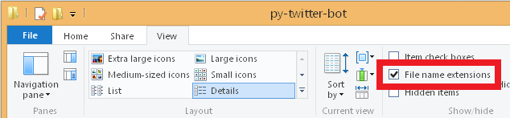

# Twitter-Bot
Really simple [Twitter](https://twitter.com/) bot for educational purposes, written in [Python](https://www.python.org/), continually tested with [Travis CI](https://travis-ci.org/), deployed on [Heroku](https://heroku.com/).

# 1. Twitter
## 1.1 Account anlegen
Der Bot benötigt Zugang zu einem Twitter-Account

* __Falls ein bestehender Account verwendet wird: Schritt 1.2. überspringen, direkt zu Schritt 2.__

## 1.2 API Keys erstellen  
<p align="center"></p>

Der Bot benötigt für den Zugriff auf Twitter Zugangsdaten (API keys und tokens, die sozusagen Name und Passwort für Programme darstellen). Diese Token sind, wie Passwörter, geheimzuhalten. Alles, was du im GitHub-Repository hochlädst ist öffentlich!

* Gehe auf https://apps.twitter.com/ und klicke auf `Create New App`
* Bei "Website" eine beliebige gültige URL angeben (z.B. `http://hpi.de`), "Callback URL" kann leer bleiben.
* Auf der Übersichtsseite der Twitter-Anwendung: Unter dem Tab "Keys and Access Tokens" findest du `Consumer Key` und `Consumer Secret`.
* Nach einem Klick auf "Create my access token" weiter unten auf der Seite können `Access Token` und `Access Token Secret` abgelesen werden.
* Speicher die 4 Schlüssel in einer Text-Datei oder lass das Browser-Tab offen während du weiterarbeitest.

# 2. Github
## 2.1. Account erstellen
* Falls nicht vorhanden, erstelle einen GitHub-Account auf http://github.com.

## 2.2 Beispiel-Repository forken
<p align="center"></p>

Wir haben bereits einen Bot vorbereitet (https://github.com/hpi-swt2-exercise/py-twitter-bot, dieses Repository).
* Obwohl der Code auf  GitHub öffentlich ist, gibt es Zugriffsbeschränkungen. Nicht jeder kann Änderungen vornehmen.
* _Aber_: ihr könnt eine eigene Kopie des Codes anlegen, die ihr dann beliebig verändern könnt!
* Mit dem "Fork" Knopf ganz oben rechts auf dieser Webseite kann ein eigene Kopie vom Projekt erstellt werden, die eurem GitHub Account zugeordnet ist.

## 2.3 Github Projekt auf den Rechner kopieren

Die Dateien des kopierten/geclonten Projekts liegen weiterhin ausschließlich auf GitHub.
Um die Dateien lokal zu bearbeiten und die Verbindung zu Github herzustellen, muss das Projekt, das "Repository" auf deinen Rechner mit git kopiert werden (mit git "geclont" werden).
Grundsätzlich kann git entweder über die Kommandozeile (`cmd`) oder mit einer grafischen Oberfläche (GUI) nutzen.
Auf den Rechnern ist die GUI "GitExt" installiert.

<p align="center"></p>

* Unter “Clone or Download” auf der Github-Seite deines Projekts (die URL sollte `https://github.com/<DEINGITHUBNAME>/py-twitter-bot` sein) findest du die Git-URL, mit der du das Projekt auf deinen Rechner klonen kannst. (Der Download als Zip reicht nicht!)

<p align="center"></p>

* Lege in deinem persönlichen Verzeichnis einen neuen Ordner an. 
* In diesem kannst du entweder über den Kommandozeilen-Befehl `git clone https://github.com/DEIN_ACCOUNT/py-twitter-bot`, oder über das Kontextmenü im Windows-Explorer `(Rechtsklick -> GitExt clone)` das Projekt klonen.

# 3. Projekt lokal einrichten

## 3.1 Abhängigkeiten installieren
Alle Abhängigkeiten des Twitter-Bots, d.h. aller Code aus Bibliotheken, die der Bot verwendet um mit den Twitter-Servern zu interagieren, sind in einer `requirements.txt` festgehalten. Diese müssen auf euren Rechnern installiert sein, damit der Bot funktioniert.
* Im `script` Ordner liegt eine `requirements.bat` Datei, die die Abhängigkeiten unter Windows installiert. Ihr könnt es durch Doppelklick ausführen. Ein Kommandozeilenfenster öffnet sich. Prüft, dass keine Fehler geworfen werden.

## 3.2 Twitter Credentials im Bot eintragen
<p align="center"></p>

* Kopiere die Datei `credentials.example.py` und nenne die Kopie `credentials.py`. Zu deiner Sicherheit ist das Repository bereits so konfiguriert, dass diese Datei nicht hochgeladen wird.
* Achte darauf, dass die Dateiendung `.py` ist. Blende dazu im windows Explorer die Dateiendungen von Dateien ein (siehe Bild).
* Trage hier die Twitter Access Keys und Tokens ein.
* Starte das Skript `run_bot` per Doppelklick.
* Die Ausgabe enthät einen Link auf den soeben gesendeten Tweet. Der Bot Account sollte einen Tweet abgesetzt haben, der die aktuelle Uhrzeit enthält.

## 3.3 Die erste Änderung
Der Bot tweetet im Moment die Uhrzeit immer nach demselben Schema: "It is <HH:MM:SS> on a <DAY>." Wenn du möchtest, ändere was der Bot von sich gibt.

* Öffne die Datei `tweet_text.py` in einem Texteditor. Zum Beispiel der "IDLE" (`Rechtsklick -> "Edit with IDLE"`) einer Programmierumgebung für Python oder "Notepad++".
* Ändere den Inhalt der Variable `text` (Zeile 23), z.B. in

`text = "Hallo HPI! Dies ist der Bot <NAMEDESBOTS>"`

* Speichere deine Änderungen
* Führe das den Bot aus, wiederum mit dem `run_bot` Skript und schaue nach, ob der Bot nun anders twittert.

## 3.4 Änderungen nach GitHub übertragen (Committen)

Die Änderungen am Bot liegen bis jetzt nur lokal in den Dateien auf dem Rechner vor. Um mit anderen zusammenzuarbeiten und ihnen den Code zugänglich zu machen, sollten sie wieder nach GitHub übertragen werden. Dazu müssen die Änderungen mit git zu einem Commit zusammengefasst und übertragen ("gepusht") werden.

* Versuche, deine Änderungen zu "committen" (Rechtsklick auf einen freien Platz im Exporer -> `GitExt commit...`) und wieder nach GitHub zu Übertragen. Auf GitHub ist die Änderung dann öffentlich und andere können sie sehen.
* Dazu müssen die Änderungen zuerst dem sogenannten "staging" Bereich in git hinzugefügt werden, wo alle Änderungen für einen Commit zusammengefasst werden und mit einer Nachricht über den Zweck der Änderungen, der "commit message", zu einem Paket (dem Commit) zusammengefasst werden.

<p align="center"></p>

* Dieser Commit muss dann nach GitHub übertragen werden ("gepusht" werden). Du musst deine GitHub-Anmeldedaten eingeben, damit GitHub dich identifizieren kann.


<hr>

**Ihr habt jetzt ein eigenes GitHub Repository mit einem Twitterbot, mit euren eigenen Änderungen, welche andere einsehen können!**

Könnt ihr anderen helfen?
<hr>

# 4. Travis CI
Als nächstes möchten wir Continuous Integration für das Projekt anlegen.

<p align="right"></p>

* Gehe dazu auf http://travis-ci.org. Hier benötigst du keinen neuen Account, du kannst dich direkt über dein Github-Konto anmelden.
* Aktiviere automatische Builds für dein Repository.

Wenn du das nächste mal eine Änderung "push"st (auf den Server bei Github überträgst), wird Travis dein Projekt automatisch erstellen. Um jederzeit den Build-Status sehen zu können, kannst du eine Badge auf deiner Projekt-Seite einbinden.
* Klicke dazu in Travis auf die Badge, wähle als Format "Markdown" aus, und kopiere den Text in die `README.md` in deinem Projekt.

<p align="center"></p>

* Commite nun deine Änderung: 
  * GitExt (`Rechtsklick -> GitExt Commit`) zeigt die welche Änderungen du vorgenommen hast (siehe 1 und 2).
  * Stage (3) die geänderten Dateien damit die Änderung Teil des Commits ist.
  * Trage dann eine Commit-Nachricht ein (4), die die Änderungen zusammenfasst und bestätige den Commit (5).

<p align="center"></p>

Nach dem Commit kannst du die Änderung pushen und auf der Travis-Seite beobachten wie dein Projekt gebaut wird. Nachdem der Vorgang erfolgreich abgeschlossen wurde, kannst du die Projektseite auf Github neu laden. Die Badge sollte jetzt grün erscheinen.

# 5. Heroku

## 5.1 Account erstellen

Damit du deinen Twitter-Bot nicht immer per Hand ausführen musst, möchten wir ihn jetzt auf Heroku deployen. Heroku ist eine Plattform auf der Code kontinuierlich auf Servern ausgeführt werden kann.

* Erstelle dazu einen Account auf http://heroku.com.

## 5.2 Anwendung erstellen

<p align="center"></p>

* Auf dem Heroku-Dashboard, klicke auf `New` und `Create new app` und erstelle eine neue Anwendung.
* Unter `Deploy` wählst du “Github” als “Deployment Method”.
* Verbinde deinen Github-Account und wähle das richtige Repository aus.

<p align="center"></p>

* Setze das Häkchen bei “Wait for CI to pass before deploy” und klicke auf “Enable Automatic Deploys”.
* Da automatische Deploys erst nach einem Push passieren, kannst du außerdem unter “Manual Deploy” auf “Deploy Branch” klicken um ein deployment (das übertragen des codes zum Server) anzustoßen.

Auch auf Heroku muss der Bot wissen, wie er sich bei Twitter anmelden kann. Damit die geheimen Daten nicht in einer Datei gespeichert werden müssen, kannst du sie direkt in Heroku konfigurieren.

* Gehe auf das Tab `Settings`, klicke auf `Reveal Config Vars` und trage dort die 4 Access Keys / Tokens des Bots ein.

## 5.3 Anwendung auf Heroku starten

<p align="center"></p>

* Damit der Bot tatsächlich ausgeführt wird, wechselst du nun auf das Tab `Resources` und aktivierst dort den Clock-Prozess.

<p align="center"></p>

Die logs, d.h. die Nachrichten, die der Bot schreibt, können im Heroku-Interface nachgelesen werden. Hier kannst du überprüfen, ob der Bot erfolgreichen starten konnte. Falls du noch einen Twitter-Account hast, schreibe ihm doch einfach mal “hi!”. In spätestens 10 Minuten solltest du eine Antwort bekommen.

# 6. Und noch viel weiter
Die verbleibende Zeit kannst du nutzen, um den Funktionsumfang deines Bots zu erweitern.

* Öffne dazu die `tweet_text.py` in der IDLE. Tipp: wenn du den Bot testen möchtest, ohne jedes mal einen neuen Tweet zu senden, drücke <kbd>F5</kbd> um die Python Shell zu öffnen.

* Mit `idle_text()` und `reply({'text': 'hi!', 'user': {'screen_name': 'Foo'}})` kannst du die Funktionen direkt testen.
* Mit <kbd>Alt</kbd> + <kbd>n</kbd> und <kbd>Alt</kbd> + <kbd>p</kbd> musst du die Aufrufe nicht jedes mal neu schreiben.

Ein Cheatsheet für Python ist hier zu finden: [link](https://ddi.ifi.lmu.de/probestudium/2013/ws-i-3d-programmierung/tutorials/python-referenzkarte)

Funktionen um mit Strings zu arbeiten gibt es [hier](https://docs.python.org/2/library/stdtypes.html#string-methods)

## 6.1 Externe Daten anfordern
Natürlich kann der Bot statt nur mit der Uhrzeit zu antworten auch beliebige andere Dinge tweeten. Insbesondere sollte er vielleicht mit der Außenwelt kommunizieren um weitere Daten zu erhalten. Solche Schnittstellen, die mit Programmen einfach nutzbar sind, heißen APIs (Application programming interface). Zum Beispiel könnten Chuck Norris Witze abgefragt und getweetet werden:

```python
from requests import get
# Some more ideas: https://www.programmableweb.com/category/humor/api
data = get('https://api.chucknorris.io/jokes/random').json()
joke = data['value']
print joke
```
## 6.2 Zufall
Möglicherweise sollte der Bot nicht immer nach demselben Schema tweeten, sondern zufällig unterschiedliche Text tweeten.
Dazu kann das `random` Modul von Python verwendet werden. Beispiel:

```python
import random

# random() returns a floating point number in the range [0.0, 1.0)
if random.random() > 0.5:
    print('GROSS')
else:
    print('klein')
```
