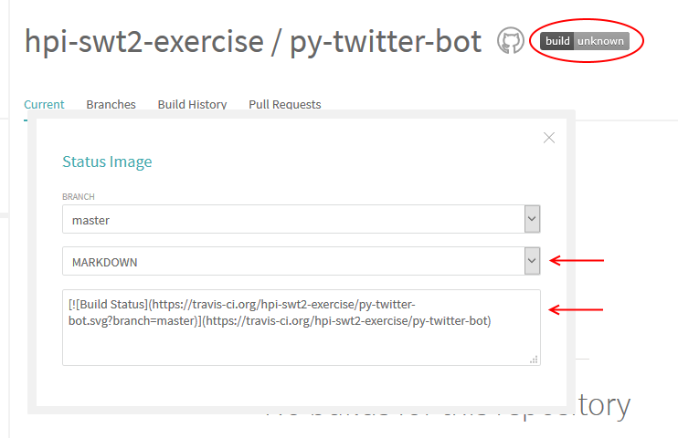

# Ein einfacher Twitter-Bot
Really simple [Twitter](https://twitter.com/) bot for educational purposes, written in [Python](https://www.python.org/), continually tested with [Travis CI](https://travis-ci.org/), deployed on [Heroku](https://heroku.com/).

# 1. Twitter
## 1.1 Account anlegen
Als erstes benötigst du einen Twitter-Account, con dem aus er Bot tweeten soll.
Falls du bereits einen Account hast, den du hierfür verwenden möchtest, kannst du diesen Schritt überspringen. Falls du aber später mit deinem Bot interagieren möchtest, solltest du trotzdem einen neuen Account anlegen.

## 1.2 API Keys erstellen  
<p align="center"></p>
Damit deine Anwendung auf deinen Twitter-Account zugreifen kann, muss sie sich gegenüber Twitter authentifizieren können. Dies geschieht nicht über dein Passwort, sondern über API Keys und Token.

Diese Token sind, wie Passwörter, geheimzuhalten. Denke später daran dass alles, was du im Git-Repository hochlädst, öffentlich ist!

Gehe auf https://apps.twitter.com/ und klicke auf “Create New App” und fülle auf der folgenden Seite das Formular aus. Als “Website” kannst du eine beliebige gültige URL angeben, “Callback URL” kannst du leer lassen.

Anschließend wirst du auf die Übersichtsseite für deine Twitter-Anwendung weitergeleitet. Unter dem Tab “Keys and Access Tokens” findest du Consumer (oder API-) Key und Secret, außerdem kannst du dort Access Token und Secret erstellen.

Speicher die 4 Schlüssel in einer Text-Datei oder lass das Browser-Tab offen während du weiterarbeitest.

# 2. Github
## 2.1. Account erstellen
Falls nicht vorhanden, erstelle einen Account auf http://github.com.

## 2.2 Beispiel-Repository forken
<p align="center"></p>

Um dir einen schnelleren Einstieg zu geben, haben wir bereits ein Programm vorbereitet (https://github.com/hpi-swt2-exercise/py-twitter-bot, dieses Repository). Mit dem  “Fork” Knopf oben rechts kann ein eigene Kopie vom Projekt erstellt werden.

<p align="center"></p>

Unter “Clone or Download” auf der Github-Seite deines neuen Projekts findest du die Git-URL, mit der du das Projekt auf deinen Rechner klonen kannst.

<p align="center"></p>

Lege dazu in deinem persönlichen Verzeichnis einen neuen Ordner an. In diesem kannst du entweder über den Kommandozeilen-Befehl `git clone https://github.com/DEIN_ACCOUNT/py-twitter-bot`, oder über das Kontextmenü im Windows-Explorer das Projekt herunterladen.

## 2.3 Twitter Credentials im Bot eintragen
Noch kann der Twitter Bot keine Tweets senden. Kopiere die Datei `credentials.example.py` und nenne die Kopie `credentials.py`. Zu deiner Sicherheit ist das Repository bereits so konfiguriert, dass diese Datei nicht hochgeladen wird.
Trage hier die Twitter Keys und Tokens ein.

Nun kannst du das Programm `twitter_bot.py` in der "IDLE" Umgebung öffnen (Rechtsklick -> "Edit with IDLE") und mit F5 starten.
Auf Twitter sollte jetzt ein Tweet erscheinen, der die aktuelle Uhrzeit enthält.

# 3. Travis CI
Als nächstes möchten wir Continuous Integration für das Projekt anlegen. Gehe dazu auf http://travis-ci.com. Hier benötigst du keinen neuen Account, du kannst dich direkt über dein Github-Konto anmelden. Aktiviere automatische Builds für dein Repository.

Wenn du das nächste mal eine Änderung “push”st, wird Travis dein Projekt automatisch erstellen. Um jederzeit den Build-Status sehen zu können, kannst du eine Badge auf deiner Projekt-Seite einbinden. Klicke dazu in Travis auf die Badge, wähle als Format “Markdown” aus, und kopiere den Text in die `README.md` in deinem Projekt.

<p align="center"></p>

Commite (Rechtsklick -> Git Commit) und pushe die Änderung, und beobachte auf der Travis-Seite wie dein Projekt gebaut wird. Nachdem der Vorgang erfolgreich abgeschlossen wurde, kannst du die Projektseite auf Github neu laden. Die Badge sollte jetzt grün erscheinen.

# 4. Heroku

## 4.1 Account erstellen

Damit du deinen Twitter-Bot nicht immer per Hand ausführen musst, möchten wir ihn jetzt auf Heroku deployen. Erstelle dazu einen Account auf http://heroku.com.

## 4.2 Anwendung erstellen

<p align="center"></p>

Auf dem Dashboard, klicke auf “New” und “Create new app” und erstelle eine neue Anwendung.

Unter “Deploy” wählst du “Github” als “Deployment Method”. Verbinde deinen Github-Account und wähle das richtige Repository aus.

<p align="center"></p>

Setze das Häkchen bei “Wait for CI to pass before deploy” und klicke auf “Enable Automatic Deploys”. Da automatische Deploys erst nach einem Push passieren, klickst du außerdem einmal unter “Manual Deploy” auf “Deploy Branch”.

Auch auf Heroku muss dein Bot wissen, wie er sich bei Twitter anmelden kann. Damit die geheimen Daten nicht in einer Datei gespeichert werden müssen, kannst du sie direkt in Heroku konfigurieren. Gehe auf das Tab “Settings”, klicke auf “Reveal Config Vars” und trage dort die 4 Schlüssel ein.

## 4.3 Anwendung auf Heroku starten

<p align="center"></p>

Damit der Bot tatsächlich ausgeführt wird, wechselst du nun auf das Tab “Resources” und aktivierst dort den Clock-Prozess.

<p align="center"></p>

Die logs, d.h. die Nachrichten, die der Bot schreibt, können im Heroku-Interface nachgelesen werden. Hier kannst du überprüfen, ob der Bot erfolgreichen starten konnte. Falls du noch einen Twitter-Account hast, schreibe ihm doch einfach mal “hi!”. In spätestens 10 Minuten solltest du eine Antwort bekommen.

# 5. Und noch viel weiter
Die verbleibende Zeit kannst du nutzen, um den Funktionsumfang deines Bots zu erweitern. Öffne dazu die `tweet_text.py` in der IDLE. Tipp: wenn du den Bot testen möchtest, ohne jedes mal einen neuen Tweet zu senden, drücke F5 um die Python Shell zu öffnen.

Mit `idle_text()` und `reply({'text': 'hi!', 'user': {'screen_name': 'Foo'}})` kannst du die Funktionen direkt testen. Mit `Alt+n` und `Alt+p` musst du die Aufrufe nicht jedes mal neu schreiben.

## 5.1 Externe Daten anfordern
Natürlich kann der Bot statt nur mit der Uhrzeit zu antworten auch beliebige andere Dinge tweeten. Insbesondere sollte er vielleicht mit der Außenwelt kommunizieren um weitere Daten zu erhalten. Solche Schnittstellen, die mit Programmen einfach nutzbar sind, heißen APIs (Application programming interface). Zum Beispiel könnten Chuck Norris Witze abgefragt und getweetet werden:

```python
from requests import get
# Some more ideas: https://www.programmableweb.com/category/humor/api
data = get('https://api.chucknorris.io/jokes/random').json()
joke = data['value']
print joke
```
## 5.2 Zufall
Möglicherweise sollte der Bot nicht immer nach demselben Schema tweeten, sondern zufällig unterschiedliche Text tweeten.
Dazu kann das `random` Modul von Python verwendet werden. Beispiel:

```python
import random

# random() returns a floating point number in the range [0.0, 1.0)
if random.random() > 0.5:
    print('GROSS')
else:
    print('klein')
```
