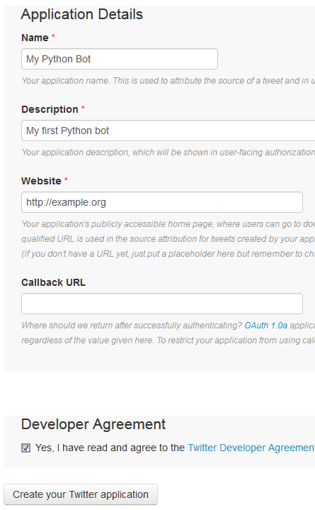
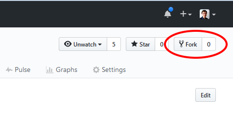
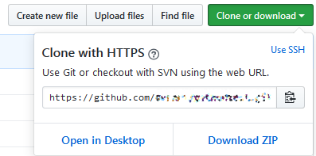
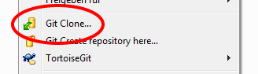
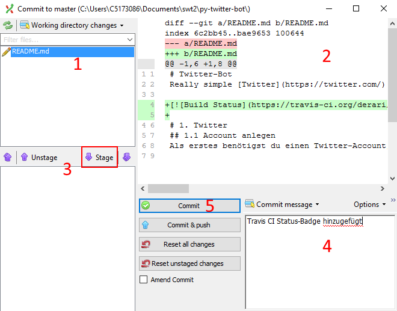
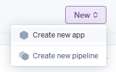
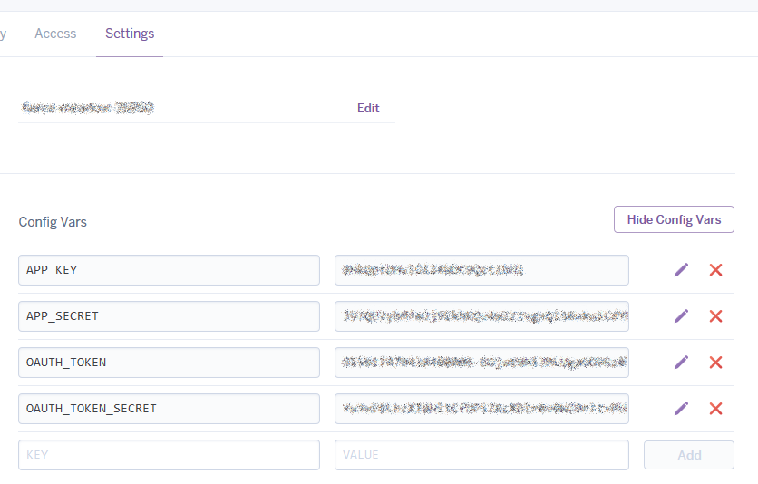
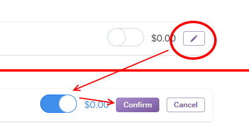
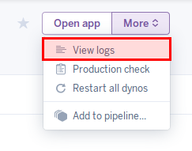

[](https://travis-ci.org/fireangel17/py-twitter-bot)


Really simple [Twitter](https://twitter.com/) bot for educational purposes, written in [Python](https://www.python.org/), continually tested with [Travis CI](https://travis-ci.org/), deployed on [Heroku](https://heroku.com/).

# 1. Twitter
## 1.1 Account anlegen
Der Bot benötigt Zugang zu einem Twitter-Account

* Falls ein bestehender Account verwendet werden soll: Schritt überspringen.

## 1.2 API Keys erstellen  
<p align="center"></p>

Der Bot benötigt für den Zugriff auf Twitter API keys und tokens (statt Username und Passwort). Diese Token sind, wie Passwörter, geheimzuhalten. Alles, was du im GitHub-Repository hochlädst ist öffentlich!

* Gehe auf https://apps.twitter.com/ und klicke auf `Create New App`
* Bei "Website" eine beliebige gültige URL angeben (z.B. `http://hpi.de`), "Callback URL" kann leer bleiben.
* Auf der Übersichtsseite der Twitter-Anwendung: Unter dem Tab "Keys and Access Tokens" findest du `Consumer Key` und `Consumer Secret`.
* Nach einem Klick auf "Create my access token" weiter unten auf der Seite können `Access Token` und `Access Token Secret` abgelesen werden.
* Speicher die 4 Schlüssel in einer Text-Datei oder lass das Browser-Tab offen während du weiterarbeitest.

# 2. Github
## 2.1. Account erstellen
* Falls nicht vorhanden, erstelle einen GitHub-Account auf http://github.com.

## 2.2 Beispiel-Repository forken
<p align="center"></p>

Wir haben bereits einen Bot vorbereitet (https://github.com/hpi-swt2-exercise/py-twitter-bot, dieses Repository).
* Mit dem  “Fork” Knopf oben rechts kann ein eigene Kopie vom Projekt erstellt werden.

## 2.3 Github-Repository auf den Rechner clonen

Um die Dateien lokal zu bearbeiten und die Verbindung zu Github herzustellen, muss das Repository auf deinen Rechner mit git "geklont" werden.
Grundsätzlich kann git entweder über die Kommandozeile (`cmd`) oder mit einer grafischen Oberfläche (GUI) nutzen.
Auf den Rechnern ist die GUI "GitExt" installiert (falls ihr auf eurem eigenen Windows-Rechner Git benutzen möchtet, empfehlen wir [TortoiseGit](https://tortoisegit.org/)). 

<p align="center"></p>

* Unter “Clone or Download” auf der Github-Seite deines Projekts findest du die Git-URL, mit der du das Projekt auf deinen Rechner klonen kannst. (Der Download als Zip reicht nicht!)

<p align="center"></p>

* Lege in deinem persönlichen Verzeichnis einen neuen Ordner an. 
* In diesem kannst du entweder über den Kommandozeilen-Befehl `git clone https://github.com/DEIN_ACCOUNT/py-twitter-bot`, oder über das Kontextmenü im Windows-Explorer `(Rechtsklick -> GitExt clone)` das Projekt klonen.

# 3. Projekt lokal einrichten

## 3.1 Abhängigkeiten installieren
Alle Abhängigkeiten des Twitter-Bots, d.h. aller Code aus Bibliotheken, sind in einer `requirements.txt` festgehalten. Diese müssen auf euren Rechnern installiert sein, damit der Bot funktioniert.
* Im `script` Ordner liegt eine `requirements.bat` Datei, die die Abhängigkeiten unter Windows installiert. Ihr könnt es durch Doppelklick ausführen, oder per Kommandozeile: `C:\Python27\python.exe <Pfad zum Repo>\requirements.bat`.

## 3.2 Twitter Credentials im Bot eintragen
* Kopiere die Datei `credentials.example.py` und nenne die Kopie `credentials.py`. Zu deiner Sicherheit ist das Repository bereits so konfiguriert, dass diese Datei nicht hochgeladen wird.
* Trage hier die Twitter Access Keys und Tokens aus Schritt 1.2 ein.

* Nun kannst du das Programm `twitter_bot.py` in der "IDLE" Umgebung öffnen (`Rechtsklick -> "Edit with IDLE"`). IDLE ist eine Programmierumgebung für Python, der Programmiersprache des Bots. 
* Das Programm kann mit <kbd>F5</kbd> gestartet werden.
* Die Ausgabe enthät einen Link auf den soeben gesendeten Tweet. Auf Twitter sollte ein Tweet erscheinen, der die aktuelle Uhrzeit enthält.

## 3.3 Die erste Änderung
Der Bot tweetet im Moment die Uhrzeit immer nach demselben Schema: "It is HH:MM:SS on a DAY (DD-MM-YYYY)." Wenn du möchtest, ändere das Format der Uhrzeit, z.B. mit dem Names deines Bots.

* Öffne dazu die `tweet_text.py` in der IDLE und ändere den Inhalt der Variable `text` (Zeile 22), z.B. in

`text = berlin_time.strftime("Der HPI-Schülerkolleg Bot sagt: %H:%M:%S! %A (%d-%m-%Y).")`


* Commite nun deine Änderung: 
  * GitExt (`Rechtsklick -> GitExt Commit`) zeigt die welche Änderungen du vorgenommen hast (siehe 1 und 2).
  * Stage (3) die geänderten Dateien damit die Änderung Teil des Commits ist.
  * Trage dann eine Commit-Nachricht ein (4), die die Änderungen zusammenfasst und bestätige den Commit (5).

<p align="center"></p>

Nach dem Commit kannst du die Änderung pushen und auf der Travis-Seite beobachten wie dein Projekt gebaut wird. Nachdem der Vorgang erfolgreich abgeschlossen wurde, kannst du die Projektseite auf Github neu laden. Die Badge sollte jetzt grün erscheinen.

[](https://travis-ci.org/FlayInAHook/py-twitter-bot)

# 5. Heroku

## 5.1 Account erstellen

Damit du deinen Twitter-Bot nicht immer per Hand ausführen musst, möchten wir ihn jetzt auf Heroku deployen. Heroku ist eine Plattform auf der Code kontinuierlich auf Servern ausgeführt werden kann.

* Erstelle dazu einen Account auf http://heroku.com.

## 5.2 Anwendung erstellen

<p align="center"></p>

* Auf dem Heroku-Dashboard, klicke auf `New` und `Create new app` und erstelle eine neue Anwendung.
* Unter `Deploy` wählst du “Github” als “Deployment Method”.
* Verbinde deinen Github-Account und wähle das richtige Repository aus.

<p align="center"></p>

* Setze das Häkchen bei “Wait for CI to pass before deploy” und klicke auf “Enable Automatic Deploys”.
* Da automatische Deploys erst nach einem Push passieren, kannst du außerdem unter “Manual Deploy” auf “Deploy Branch” klicken um ein deployment (das übertragen des codes zum Server) anzustoßen.

Auch auf Heroku muss der Bot wissen, wie er sich bei Twitter anmelden kann. Damit die geheimen Daten nicht in einer Datei gespeichert werden müssen, kannst du sie direkt in Heroku konfigurieren.

* Gehe auf das Tab `Settings`, klicke auf `Reveal Config Vars` und trage dort die 4 Access Keys / Tokens des Bots ein.

## 5.3 Anwendung auf Heroku starten

<p align="center"></p>

* Damit der Bot tatsächlich ausgeführt wird, wechselst du nun auf das Tab `Resources` und aktivierst dort den Clock-Prozess.

<p align="center"></p>

Die logs, d.h. die Nachrichten, die der Bot schreibt, können im Heroku-Interface nachgelesen werden. Hier kannst du überprüfen, ob der Bot erfolgreichen starten konnte. Falls du noch einen Twitter-Account hast, schreibe ihm doch einfach mal “hi!”. In spätestens 10 Minuten solltest du eine Antwort bekommen.

# 6. Und noch viel weiter
Die verbleibende Zeit kannst du nutzen, um den Funktionsumfang deines Bots zu erweitern.

* Öffne dazu die `tweet_text.py` in der IDLE. Tipp: wenn du den Bot testen möchtest, ohne jedes mal einen neuen Tweet zu senden, drücke <kbd>F5</kbd> um die Python Shell zu öffnen.

* Mit `idle_text()` und `reply({'text': 'hi!', 'user': {'screen_name': 'Foo'}})` kannst du die Funktionen direkt testen.
* Mit <kbd>Alt</kbd> + <kbd>n</kbd> und <kbd>Alt</kbd> + <kbd>p</kbd> musst du die Aufrufe nicht jedes mal neu schreiben.

Ein Cheatsheet für Python ist hier zu finden: [link](https://ddi.ifi.lmu.de/probestudium/2013/ws-i-3d-programmierung/tutorials/python-referenzkarte)

Funktionen um mit Strings zu arbeiten gibt es [hier](https://docs.python.org/2/library/stdtypes.html#string-methods)

## 6.1 Externe Daten anfordern
Natürlich kann der Bot statt nur mit der Uhrzeit zu antworten auch beliebige andere Dinge tweeten. Insbesondere sollte er vielleicht mit der Außenwelt kommunizieren um weitere Daten zu erhalten. Solche Schnittstellen, die mit Programmen einfach nutzbar sind, heißen APIs (Application programming interface). Zum Beispiel könnten Chuck Norris Witze abgefragt und getweetet werden:

```python
from requests import get
# Some more ideas: https://www.programmableweb.com/category/humor/api
data = get('https://api.chucknorris.io/jokes/random').json()
joke = data['value']
print joke
```
## 6.2 Zufall
Möglicherweise sollte der Bot nicht immer nach demselben Schema tweeten, sondern zufällig unterschiedliche Text tweeten.
Dazu kann das `random` Modul von Python verwendet werden. Beispiel:

```python
import random

# random() returns a floating point number in the range [0.0, 1.0)
if random.random() > 0.5:
    print('GROSS')
else:
    print('klein')
```
